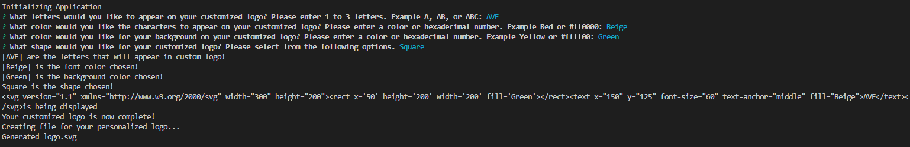
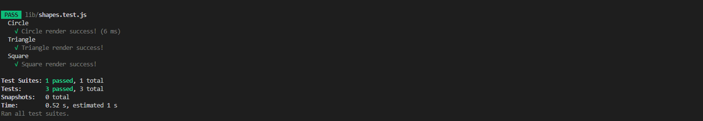
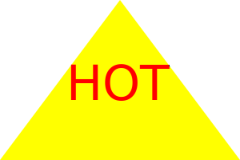
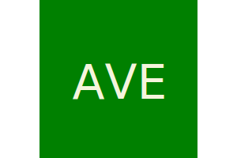
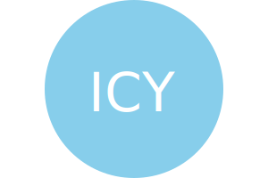

# Logo Design

## Table of Contents

* [Description](#description)
* [Installation](#installation)
* [Usage](#usage)
* [Credits](#credits)
* [Screenshots](#screenshots)
* [Video](#video)
* [Link to Website](#link-to-website)
* [License](#license)

## Description

Logo Design is a Node.js application that allows a user generate a customized logo and save the logo as a Scalable Vector Graphics file.

## Installation

This application is run using Node.js. The user must install Node.js in order to utilize this application. 

## Usage

The user will answer a series of questions in order to generate a customized logo according to their preferences. The user will select what characters they want in their logo within a range of 1 to 3 characters. The user will select their color preferences for letters and background. The user will select shape preference for logo with Circle, Triangle, and Square being the available options. Once all questions are answered, this application will generate a customized logo to meet user preferences and save the logo as a logo.svg file.

## Credits

Tutor Guidance provided by Alexis San Juan.

Application done in collaboration with coding students Kalyn Sifuentes, Joshua Hale, and Angela Cortes.

YouTube Video accessed for function guidance: https://www.youtube.com/watch?v=GJYMcLus3v0 by Thoscalle

## Screenshots

Application Main Screen:

Jest Test Screenshot:

Example Image #1 using this application with triangle shape and hexadecimal form:

Example Image #2 using this application with square shape:

Example Image #3 using this application with circle shape:

## Video

https://drive.google.com/file/d/1YktuIECgUMWQwANl3YOi1SZN3IVpUcMO/view

## Link to Website

N/A

## License

This application is licensed under the Apache 2.0 License.

https://opensource.org/licenses/Apache-2.0